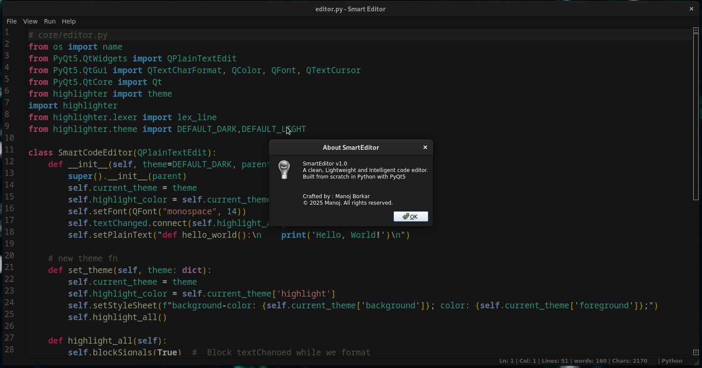

# Smart Code Editor 

A clean, lightweight, and intelligent **code editor** built from scratch in **Python (PyQt5)**.  
Designed to be minimal, elegant, and extensible – a personal project to learn & explore **GUI development, syntax highlighting, lexers, and editor design**. 

- Furthermore, it lays the foundation for advanced features like autocomplete and AI-assisted coding.

---

## ✨ Features

✅ **File Management**
- Open, Edit, and Save files with ease  
- **File Type Detection** (Python, JavaScript, HTML, C/C++, Java, etc.)  
- **Basic Shortcuts** (Ctrl+S, Ctrl+N, Ctrl+O)  


✅ **Beautiful Interface**
- **Dark & Light Themes** (toggle support)  
- **Current-line highlighting** and custom color palettes  
- Designed for focus and simplicity  

✅ **Coding Essentials**
- **Syntax highlighting** (supports Python as of now)  
- **Real-time file stats** (line, column, word, character count)  
- **Line numbers**  
- **Keyboard shortcuts** for faster workflow  

---

## Screenshots / Previews

#### Dark Theme (Default)


***

#### Light Theme


***

#### About



---

## Tech Stack

- **Python 3.10+**  
- **PyQt5** (GUI framework)  
- **Custom syntax highlighter** (`highlighter/lexer.py`)  
- Modular architecture for editor, themes, and future extensions  

---


## 🚀 Getting Started
### 1. Clone the repository
```bash
git clone https://github.com/m4noj/smart-editor.git
cd smart-editor
```
### 2. Install dependencies

```bash
pip install -r requirements.txt
```

### 3. Run the editor
```bash
python main.py
```

---

## Future Roadmap

- Autocomplete & Intelligent Code Hints  
- Integrated Terminal (QProcess / QTermWidget)
- Sidebar & Multitab support  
- Code Snippets & Templates  
- Multi-tab Editing  
- More language-specific syntax highlighters  

